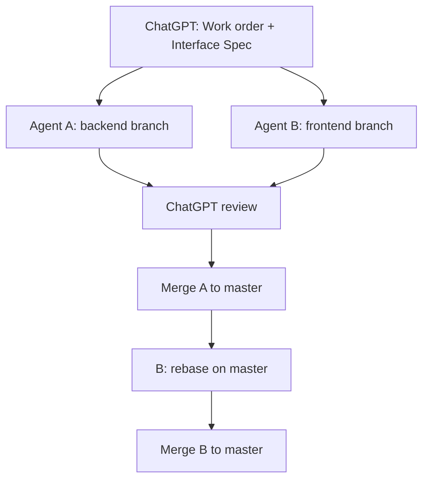

# SmartKorp HubChat — AI Agent Collaboration Rules

This document defines how **Agent A**, **Agent B**, **ChatGPT**, and **GitHub** coordinate development for SmartKorp HubChat. It complements [SKILL.md](../SKILL.md) (project skill, Phase II status, git workflow) and applies to all AI-assisted implementation work in this repository.

---

## 1. Roles

### ChatGPT

ChatGPT is the planner, reviewer, scope controller, and merge traffic controller.

**Responsibilities:**

- Define work orders.
- Freeze interface technical specs.
- Review reports, diffs, and PR summaries.
- Control merge order.
- Identify regression risk.
- Decide whether work is **PASS**, **PASS WITH NOTES**, **NEEDS CHANGES**, or **BLOCKED**.

ChatGPT does not replace the human product owner for production incidents or credential management.

### Agent A

Agent A owns backend, architecture, data, security, and runtime systems.

**Typical scope:**

- Supabase migrations and schema mirrors.
- API routes (`app/api/**`).
- Domain types and use cases.
- Repository ports and implementations.
- Queue, outbox, worker behavior.
- Channel adapters.
- Backend tests and route tests.
- Security-sensitive code.

### Agent B

Agent B owns frontend, UX, UI models, and E2E tests.

**Typical scope:**

- Dashboard pages (`app/dashboard/**` route shells).
- Team Inbox UI.
- Team Members UI.
- Ops UI.
- Channel Settings UI (when assigned).
- CSS scoped to UI work (`app/globals.css` — high-risk; see §7).
- Frontend model helpers (`src/ui/**`).
- UI unit tests.
- Playwright smoke tests (`tests/e2e/**`).

### GitHub

**`origin/master`** is the source of truth.

Each agent must work on its own branch. Agents must not share a branch unless ChatGPT explicitly approves.

---

## 2. Work modes

There are two approved work modes.

### Sequential mode

Use sequential mode when the backend contract is uncertain or high risk.

**Flow:**

1. ChatGPT creates Agent A backend work order.
2. Agent A implements backend / schema / API.
3. ChatGPT reviews Agent A work.
4. Agent A opens PR.
5. PR merges to `master`.
6. Agent B syncs latest `master`.
7. Agent B implements UI / E2E.

Default for large features, schema changes, or work without a frozen spec.

### Contract-first parallel mode

Use contract-first parallel mode when the interface is clear enough to freeze.

**Flow:**

1. ChatGPT freezes an Interface Technical Spec (see §3).
2. Agent A implements backend according to the spec.
3. Agent B implements UI according to the same spec.
4. ChatGPT reviews both agents (A before merge; B after rebase when applicable).
5. Agent A PR merges first.
6. Agent B rebases or resets from latest `origin/master`.
7. Agent B resolves any contract drift and re-verifies.
8. Agent B PR merges second.

**Parallel work is allowed. Parallel merging is not allowed.**

---

## 3. Interface Technical Spec

Agents A and B may work in parallel **only after** ChatGPT freezes an Interface Technical Spec.

The spec must include:

| Item | Description |
|------|-------------|
| **Work Order ID** | e.g. WO-F1-A, WO-F1-B |
| **API paths** | Exact paths (e.g. `/api/ops/runtime`) |
| **HTTP methods** | GET, POST, PATCH, DELETE, etc. |
| **Request DTO** | JSON shape, headers (`Authorization`, `x-tenant-id`), query params |
| **Response DTO** | Success body, pagination wrappers if any |
| **Role and permission behavior** | Who may call; 401 / 403 behavior |
| **Error behavior** | Status codes, error field shape, user-safe messages |
| **Validation rules** | Server-side constraints; what UI must not assume |
| **Security rules** | Auth, tenant scope, secrets never in client |
| **Data sensitivity rules** | What must not appear in logs, UI, or E2E artifacts |
| **File ownership** | Which agent owns which paths for this feature |
| **Merge order** | Backend PR first, UI PR second (with PR numbers when known) |
| **Rollback / fallback** | Feature flags, degraded UI, or “not available” when relevant |

Once frozen, agents must not change the spec independently. If the spec needs to change, the agent must stop and ask ChatGPT. ChatGPT re-freezes; both agents re-sync from `origin/master` if already in flight.

**Example:** `GET /api/ops/runtime` (PR #44) frozen before Ops Runtime UI (WO-F1-B / PR #45).

---

## 4. Merge order

When UI depends on backend / schema / API, merge order must be:

1. **Backend / schema / API contract PR** (Agent A).
2. **UI / E2E consumer PR** (Agent B).

Agent B may implement in parallel, but Agent B must rebase or reset from latest `origin/master` after Agent A merges.

Do not merge UI that depends on an unmerged API contract unless ChatGPT explicitly approves a temporary feature flag or mock.

**Squash merge only.** Small PRs. **CI green** before merge. Do not merge until ChatGPT approval (e.g. `APPROVED_TO_MERGE` per SKILL.md).

---

## 5. Rebase / sync rules

### Before starting work

```bash
git checkout master
git fetch origin
git reset --hard origin/master
git status --short
git log --oneline -5
```

Confirm HEAD matches the work order’s expected base (or newer). Create a dedicated branch; do not commit on `master`.

### After Agent A merges (Agent B)

Before final PR or ChatGPT review:

```bash
git fetch origin
git checkout <agent-b-branch>
git rebase origin/master
```

Use `git reset --hard origin/master` and replay commits **only** when ChatGPT explicitly approves.

Then:

- Resolve **contract drift** (DTO field names, paths, auth, status codes).
- Re-run full verification (§10).
- Update the report with the new base commit.
- Submit for ChatGPT review.

Agent A does not need this step when merge order prevents B from merging first.

---

## 6. File ownership

### Agent A owns

- `app/api/**`
- `src/domain/**`
- `src/application/**`
- `src/infrastructure/**`
- `src/interfaces/api/**`
- `src/worker/**`
- `src/lib/**` (when server / worker concerns)
- `supabase/**` (schema, migrations)
- Channel adapters under `src/infrastructure/adapters/channels/**`

### Agent B owns

- `app/dashboard/**` (thin route pages only)
- `src/ui/**`
- `tests/e2e/**`
- `app/globals.css` — narrow, page-scoped additions only; requires work-order approval (§7)

### Shared / cross-lane

Changes outside the owning lane or in §7 high-risk paths require **explicit ChatGPT approval** in the work order.

Neither agent owns `package.json` / `package-lock.json` unless ChatGPT assigns dependency work.

---

## 7. High-risk files

Treat edits as **approval-required** unless the work order explicitly allows them:

| Path | Risk |
|------|------|
| `app/globals.css` | Affects Inbox, Team Members, Ops, and dashboard layouts |
| `src/ui/DashboardPage.tsx` | Large Team Inbox surface |
| `src/ui/TeamMembersPage.tsx` | Team roster UX and layout |
| `src/domain/ports.ts` | Core domain boundaries |
| `src/domain/contracts.ts` (if present) / shared contract types | Cross-agent drift |
| `app/api/**` | Security and public contract surface |
| `supabase/migrations/**` | Irreversible DB history |
| `package.json` / `package-lock.json` | Supply chain and CI |

---

## 8. Forbidden behavior

Agents **must not**:

- Merge their own PRs without ChatGPT review and explicit merge approval.
- Change another agent’s lane without ChatGPT approval.
- Copy unreviewed code between machines or agents (use git + PR only).
- Commit secrets, `.env`, `.env.local`, credentials, or tokens.
- Run `npm audit fix` or broad dependency bumps unless explicitly approved.
- Use `git add .` — stage explicit paths only (see SKILL.md).
- Force-push `master` or merge with red CI.
- Change a frozen Interface Technical Spec without ChatGPT.

---

## 9. Required report format

Every agent delivery to ChatGPT must include:

| Field | Description |
|-------|-------------|
| **Branch** | e.g. `feature/phase-ii-f1-ops-runtime-ui` |
| **Base commit** | SHA and one-line message from `origin/master` at start |
| **Files changed** | List with brief purpose |
| **What changed** | Implementation summary |
| **Verification results** | Outcomes of §10 commands |
| **Guardrails checked** | Lanes and files intentionally not touched |
| **Risks / notes** | Regressions, env deps, follow-ups |
| **Contract for other agent** | If parallel: spec ID, endpoints, DTOs, merge order |

Analysis-only work orders use the same format; **Files changed** may be empty.

---

## 10. Required verification

Before **commit**, **push**, or **PR ready for review**:

```bash
git diff --check
npm run typecheck
npm run lint
npm test
npm run build
```

**Docs-only** changes: `git diff --check` is required; npm commands are optional unless CI doc tooling requires them.

- **Agent B** after UI / layout / runtime changes: note if E2E ran; staging smoke per [hubchat-smoke-test-inventory.md](./hubchat-smoke-test-inventory.md) when ChatGPT requests it.
- **Agent A** after API / schema changes: include route tests and migration notes in the report.

---

## 11. PR rules

| Rule | Detail |
|------|--------|
| **Size** | Small, reviewable PRs |
| **Draft** | Draft PRs allowed while awaiting review |
| **Merge strategy** | Squash merge only |
| **CI** | Green required before merge |
| **Production smoke** | Required after UI, layout, or runtime-facing changes when ChatGPT directs |
| **Work order link** | Include WO ID in PR title or body |
| **Do not merge** | Until ChatGPT approval (e.g. `APPROVED_TO_MERGE`) |

---

## Quick reference workflow



**Sequential:** ChatGPT → A → review → merge A → sync → B → review → merge B

**Contract-first parallel:** ChatGPT → frozen spec → A + B → review A → merge A → rebase B → review B → merge B

---

## Related documents

- [SKILL.md](../SKILL.md) — Phase II status, git safety, approval states
- [PHASE_II_PLAN.md](./PHASE_II_PLAN.md) — roadmap
- [hubchat-smoke-test-inventory.md](./hubchat-smoke-test-inventory.md) — E2E and smoke scope
- [architecture.md](./architecture.md) — system layers and API overview
