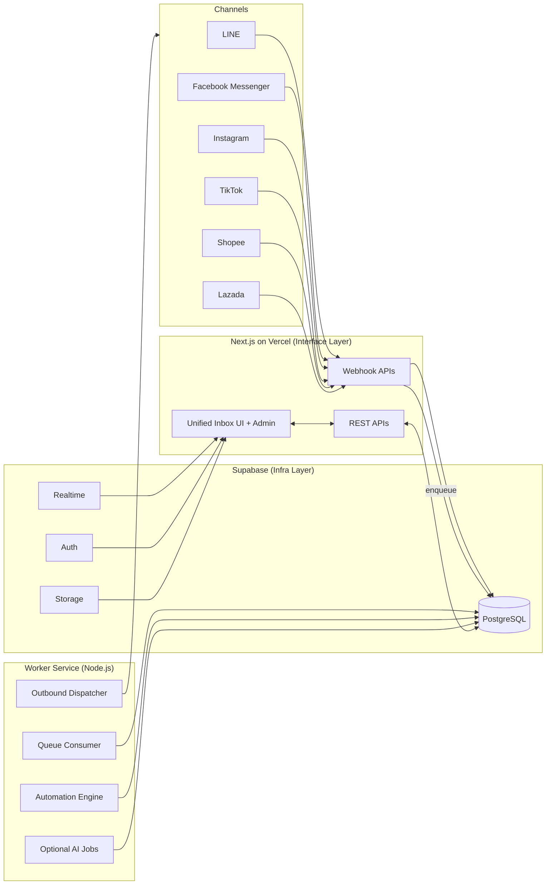
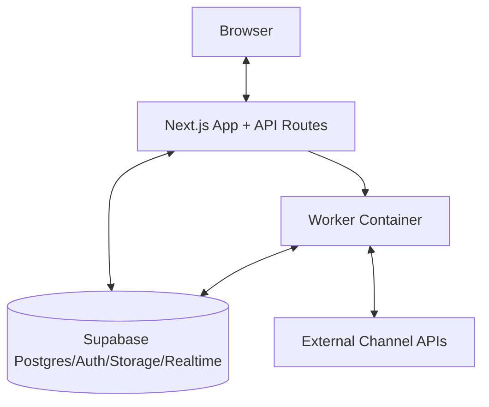
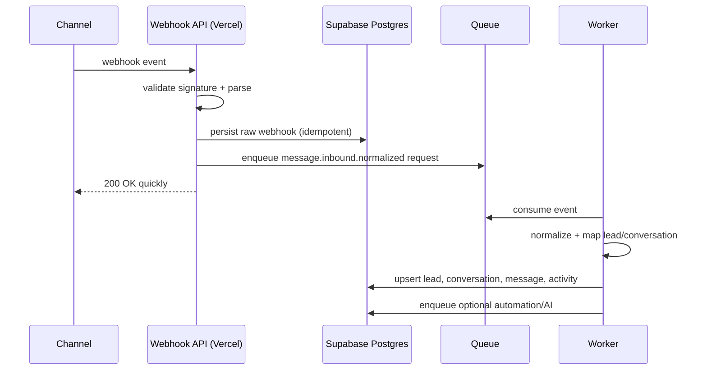
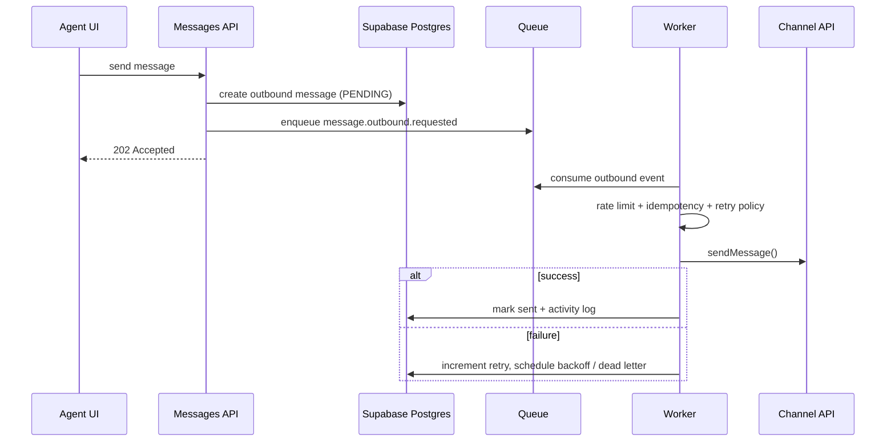

# Omnichannel Chat - Phase 1 Architecture (Supabase + Vercel + Worker)

## 1) System Architecture Diagram



## 2) Container Architecture Diagram



## 3) Module / Service Breakdown

- `interfaces` (UI/API/webhook controllers): HTTP contracts, validation, auth.
- `application` (use cases): `ProcessInboundMessage`, `AssignLead`, `SendOutboundMessage`, `UpdateLeadStatus`.
- `domain` (pure business): entities, enums, state transitions, ports.
- `infrastructure` (replaceable adapters): Supabase repositories, queue implementation, channel adapters, AI providers.
- `worker` (async runtime): queue consumer, retry/dead-letter/rate limit/idempotency.

## 4) PostgreSQL Schema

See `supabase/schema.sql`.

## 5) Event Schema

```ts
type DomainEvent<TPayload> = {
  eventId: string;
  tenantId: string;
  eventType:
    | "channel.webhook.received"
    | "message.inbound.normalized"
    | "lead.created"
    | "lead.assigned"
    | "message.outbound.requested"
    | "message.outbound.sent"
    | "message.outbound.failed"
    | "automation.triggered"
    | "ai.job.requested";
  payload: TPayload;
  occurredAt: string;
  idempotencyKey: string;
  traceId?: string;
};
```

## 6) API Design (Phase 1)

- `POST /api/webhook/{channel}`
- `GET /api/leads`
- `GET /api/leads/{id}`
- `PATCH /api/leads/{id}`
- `POST /api/leads/{id}/assign`
- `GET /api/conversations`
- `POST /api/messages/send`
- `GET /api/dashboard/metrics`

All endpoints include `tenant_id` scoping through authenticated context.

## 7) Queue Abstraction Design

```ts
export interface QueuePort {
  enqueue<T>(topic: string, event: T, opts?: { runAt?: Date }): Promise<void>;
  consume<T>(topic: string, handler: (event: T) => Promise<void>): Promise<void>;
}
```

Phase 1 implementation: DB-backed queue table in Postgres.
Phase 2+: swap in Kafka by replacing infrastructure adapter only.

## 8) Inbound Message Sequence



## 9) Outbound Message Sequence



## 10) Phase 1 Deployment Architecture

- Vercel hosts Next.js app + lightweight API/webhook routes.
- Supabase hosts Postgres/Auth/Storage/Realtime.
- Worker service on Railway/Render/Fly/Cloud Run.
- Secret management via Vercel/Supabase/worker env vars.
- Vercel only validates and enqueues; worker does heavy processing.

## 11) Phase 2 Upgrade Path

- Replace DB queue adapter with Kafka adapter (no use case changes).
- Introduce read model/indexing (OpenSearch) via projection workers.
- Split worker into independent services: inbound processor, outbound sender, automation, AI.
- Add OpenTelemetry tracing and centralized logs/metrics.
- Add CDC/event bus for analytics warehouse.

## 12) Codebase Structure

```text
src/
  domain/
    entities.ts
    events.ts
    ports.ts
    services.ts
  application/
    usecases/
      processInboundMessage.ts
      assignLead.ts
      sendOutboundMessage.ts
  infrastructure/
    adapters/
      channels/
        lineAdapter.ts
        messengerAdapter.ts
        instagramAdapter.ts
        tiktokAdapter.ts
        shopeeAdapter.ts
        lazadaAdapter.ts
      queue/
        dbQueue.ts
      repositories/
        supabaseLeadRepository.ts
  interfaces/
    api/
      webhook/
        line.ts
      leads.ts
      messages.ts
      dashboard.ts
  worker/
    main.ts
    outboundWorker.ts
```
