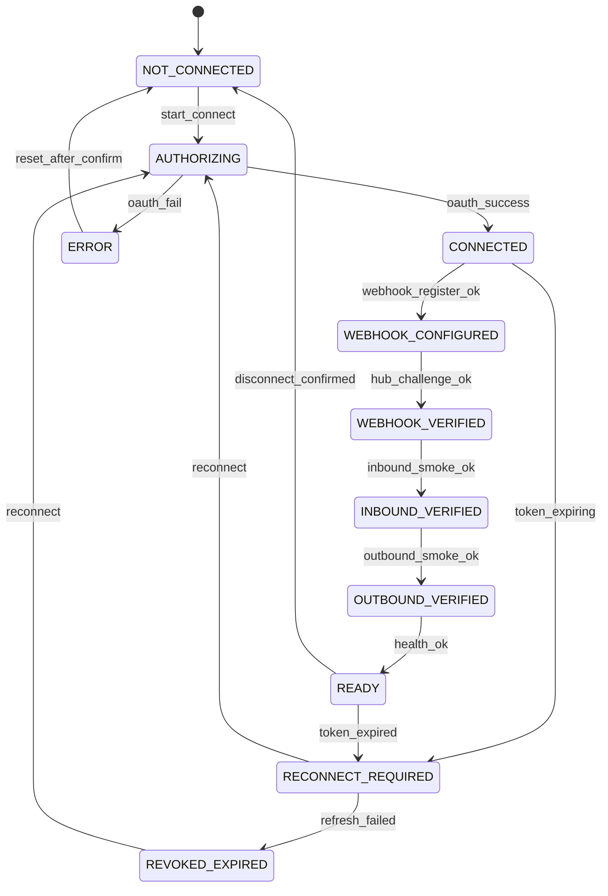

# CCP-0 — Channel Connect Wizard UX / Product Spec

**Status:** Design specification only (no UI implementation in this PR)
**Agent:** B (Product / UX)
**Date:** 2026-06-04
**Audience:** SmartKorp operators, tenant ADMINs, implementation agents (A/C)
**Scope:** Fully automatic channel onboarding for LINE OA, Facebook Page, Instagram professional account

---

## 0. Executive summary

The **Channel Connect Wizard** replaces manual Vercel/Railway ENV configuration with a tenant-scoped, DB-backed connect flow at `/dashboard/channel-connect`. Customers connect channels through provider-native authorization (LINE Module Channel attach, Meta OAuth/Login) and complete automated webhook + smoke verification before the channel is marked **Ready**.

**Out of scope (CCP-0):** Marketplace module, UI implementation, backend/API/worker/migration code, package changes.

**Paused:** Marketplace integrations.

**Production reality (2026-06):** Meta OAuth foundation is not yet in production. LINE Module Channel partner flow is not yet wired. This spec defines the **target UX** and what must stay hidden until Agent A’s backend foundation lands.

---

## 1. Goals and principles

| Goal | Principle |
|------|-----------|
| Zero platform ENV edits for customers | Credentials stored encrypted in DB per tenant; runtime reads DB (future `DB_ONLY` / tenant resolver) |
| Fully automatic connect | Wizard drives OAuth/attach → webhook register → verify → smoke tests |
| Operator-safe | Never display secrets; Thai-first copy; actionable errors without leaking provider payloads |
| Reversible | Disconnect / reconnect with explicit confirmation |
| Observable | Channel health + smoke checklist visible on one screen |

**Personas**

- **Tenant ADMIN** — runs connect wizard, sees health, can disconnect/reconnect.
- **MANAGER / SALES** — read-only channel health badge on dashboard (optional phase); cannot connect.
- **SmartKorp operator** — supports customers using runbooks; never asks for pasted tokens in chat.

---

## 2. Information architecture — `/dashboard/channel-connect`

### 2.1 Navigation placement

```
Dashboard
├── Inbox (existing)
├── Leads / Analytics / … (existing)
├── Channel Connect          ← NEW primary onboarding surface
│   └── /dashboard/channel-connect
├── Channel Settings (legacy) ← KEEP until wizard reaches parity; link “Advanced / manual”
└── Ops Runtime (ADMIN, existing)
```

**Rail / sidebar label (TH):** `เชื่อมต่อช่องทาง`
**Rail / sidebar label (EN fallback):** `Channel Connect`

**Breadcrumb:** `แดชบอร์ด › เชื่อมต่อช่องทาง`

### 2.2 Page layout (desktop)

```
┌─────────────────────────────────────────────────────────────────┐
│ เชื่อมต่อช่องทาง                                    [? คู่มือ] │
│ เชื่อม LINE, Facebook และ Instagram อัตโนมัติ — ไม่ต้องแก้ ENV │
├─────────────────────────────────────────────────────────────────┤
│ Channel overview cards (3 columns)                               │
│  ┌──────────────┐ ┌──────────────┐ ┌──────────────┐             │
│  │ LINE OA      │ │ Facebook Page│ │ Instagram    │             │
│  │ [state chip] │ │ [state chip] │ │ [state chip] │             │
│  │ progress bar │ │ progress bar │ │ progress bar │             │
│  │ [CTA]        │ │ [CTA]        │ │ [CTA]        │             │
│  └──────────────┘ └──────────────┘ └──────────────┘             │
├─────────────────────────────────────────────────────────────────┤
│ Selected channel detail panel (wizard stepper + activity log)    │
│  Step 1 Authorize → 2 Webhook → 3 Inbound → 4 Outbound → Ready  │
├─────────────────────────────────────────────────────────────────┤
│ Smoke checklist (collapsible) + Channel health summary           │
└─────────────────────────────────────────────────────────────────┘
```

### 2.3 Mobile layout

- Stacked channel cards; tapping a card opens full-screen wizard sheet.
- Stepper becomes vertical checklist with current step expanded.

### 2.4 Relationship to `/dashboard/channel-settings`

| Surface | Purpose | CCP-0 |
|---------|---------|-------|
| **Channel Connect** | Customer self-serve OAuth/attach + automated verify | Primary for new tenants |
| **Channel Settings** | Manual secret entry, test connection, legacy ENV parity | Link: “การตั้งค่าขั้นสูง (ด้วยตนเอง)” — ADMIN only |

Do not duplicate secret inputs on Channel Connect. Settings page remains for SmartKorp internal recovery until deprecated.

---

## 3. Unified connection state model

All channels share one state machine. UI maps internal backend substates to a single **display state** per channel card.



### 3.1 Display states — definitions

| State ID | Meaning | Customer-visible? |
|----------|---------|-------------------|
| `NOT_CONNECTED` | No DB credentials / no OAuth session | Yes |
| `AUTHORIZING` | Popup/redirect in progress | Yes (spinner) |
| `CONNECTED` | Tokens stored; webhook not yet registered | Yes (internal step; brief) |
| `WEBHOOK_CONFIGURED` | Callback URL + verify token written at provider | Yes |
| `WEBHOOK_VERIFIED` | Hub challenge succeeded | Yes |
| `INBOUND_VERIFIED` | Test inbound received & shown in inbox | Yes |
| `OUTBOUND_VERIFIED` | Test outbound delivered to customer device | Yes |
| `READY` | All smokes pass; channel enabled for production | Yes |
| `ERROR` | Recoverable failure with categorized message | Yes |
| `RECONNECT_REQUIRED` | Token near expiry or partial revoke | Yes |
| `REVOKED_EXPIRED` | Refresh impossible; must re-authorize | Yes |

**Progress bar steps (5 ticks):** เชื่อมต่อ → Webhook → รับข้อความ → ส่งข้อความ → พร้อมใช้งาน

---

## 4. Thai-friendly copy — per state

### 4.1 Channel card chips (short)

| State | Chip (TH) | Subtitle (TH) |
|-------|-----------|---------------|
| NOT_CONNECTED | ยังไม่เชื่อมต่อ | กดเพื่อเริ่มเชื่อมต่ออัตโนมัติ |
| AUTHORIZING | กำลังยืนยันตัวตน… | โปรดทำรายการในหน้าต่าง LINE / Meta |
| CONNECTED | เชื่อมต่อแล้ว | กำลังตั้งค่า Webhook |
| WEBHOOK_CONFIGURED | ตั้งค่า Webhook แล้ว | กำลังตรวจสอบ Webhook |
| WEBHOOK_VERIFIED | Webhook พร้อม | รอทดสอบรับข้อความ |
| INBOUND_VERIFIED | รับข้อความได้ | รอทดสอบส่งข้อความ |
| OUTBOUND_VERIFIED | ส่งข้อความได้ | กำลังตรวจสอบสุขภาพช่องทาง |
| READY | พร้อมใช้งาน | ใช้งานใน Inbox ได้แล้ว |
| ERROR | มีปัญหา | ดูรายละเอียดด้านล่าง |
| RECONNECT_REQUIRED | ต้องเชื่อมต่อใหม่ | สิทธิ์ใกล้หมดอายุ — กรุณายืนยันใหม่ |
| REVOKED_EXPIRED | สิทธิ์หมดอายุ | กรุณาเชื่อมต่อใหม่ |

### 4.2 Primary CTAs (TH)

| Context | Button |
|---------|--------|
| NOT_CONNECTED | `เริ่มเชื่อมต่อ` |
| AUTHORIZING | `กำลังดำเนินการ…` (disabled) |
| Mid-wizard | `ดำเนินการต่อ` / `ทดสอบอีกครั้ง` |
| READY | `ดู Inbox` / `ทดสอบอีกครั้ง` |
| ERROR / RECONNECT | `ลองใหม่` / `เชื่อมต่อใหม่` |
| READY / any connected | `ยกเลิกการเชื่อมต่อ…` (destructive, secondary) |

### 4.3 Wizard step titles (TH)

1. **ยืนยันตัวตนกับผู้ให้บริการ** — “เข้าสู่ระบบและอนุญาต SmartKorp HubChat”
2. **ตั้งค่า Webhook อัตโนมัติ** — “ระบบจะลงทะเบียน URL รับข้อความให้โดยอัตโนมัติ”
3. **ทดสอบรับข้อความ (Inbound)** — “ส่งข้อความทดสอบจากบัญชีลูกค้า”
4. **ทดสอบส่งข้อความ (Outbound)** — “ส่งข้อความตอบกลับจาก HubChat”
5. **พร้อมใช้งาน** — “ช่องทางพร้อมใช้งานใน Inbox”

---

## 5. Channel-specific wizard flows

### 5.1 LINE OA — full automatic (LINE Module Channel attach)

**Target backend dependency:** LINE Module Channel partner attach API + tenant DB credential vault (Agent A).

| Step | System action | User action | Success criteria |
|------|---------------|-------------|----------------|
| 1 | Open LINE Login / Module Channel attach URL | ADMIN logs into LINE OA manager; selects OA to attach | Attach token + channelId stored in DB |
| 2 | Register webhook URL `{tenantHubBase}/api/webhook/line` | None (automatic) | LINE webhook endpoint set |
| 3 | Verify webhook (LINE challenge if applicable) | None | `WEBHOOK_VERIFIED` |
| 4 | Inbound smoke | User sends test message from LINE to OA | Message in Inbox within SLA |
| 5 | Outbound smoke | User taps “ส่งข้อความทดสอบ” in wizard | LINE client receives reply |
| 6 | Ready | Enable channel row | `READY` + health green |

**Displayed metadata (safe):**

- OA name, basicId (@xxx), picture URL, webhook URL (read-only), secret status badges only.

**LINE-specific errors:** see §6.

**Hidden until backend ready:** Entire LINE card CTA “เริ่มเชื่อมต่อ” → show badge `เร็วๆ นี้` and tooltip “ต้องเปิดใช้ LINE Module Channel กับ SmartKorp ก่อน”.

---

### 5.2 Facebook Page — Meta OAuth / Login (SmartKorp Meta App)

**Target backend dependency:** SmartKorp Meta App, OAuth redirect, Page subscription API, DB token storage with refresh (Agent A).

| Step | System action | User action | Success criteria |
|------|---------------|-------------|----------------|
| 1 | Redirect to Meta OAuth (`pages_manage_metadata`, `pages_messaging`, `pages_read_engagement`, …) | ADMIN selects Facebook account; grants Page access | Long-lived Page token + pageId in DB |
| 2 | Subscribe Page to app; set webhook `{hubBase}/api/webhook/facebook` | None | Meta subscription active |
| 3 | Webhook verify (hub.mode=subscribe) | None | `WEBHOOK_VERIFIED` |
| 4 | Inbound smoke | Send Messenger message to Page | Inbox thread created |
| 5 | Outbound smoke | Wizard sends test reply | Messenger receives message |
| 6 | Ready | Enable FACEBOOK channel | `READY` |

**Displayed metadata:** Page name, Page ID (public), profile picture, webhook URL (read-only).

**Page selection UI:** If user has multiple Pages, show picker after OAuth — “เลือกเพจที่ต้องการเชื่อมต่อ”.

**Hidden until backend ready:** Connect button disabled; copy “การเชื่อมต่อ Facebook แบบอัตโนมัติจะเปิดใช้หลัง SmartKorp เปิดใช้ Meta OAuth”.

---

### 5.3 Instagram professional account — Meta / Instagram Login

**Target backend dependency:** Instagram Login product, separate IG app secret in DB (`INSTAGRAM_APP_SECRET`), OAuth, webhook on `/api/webhook/instagram`, comment + DM subscriptions (Agent A + prior webhook hotfixes).

| Step | System action | User action | Success criteria |
|------|---------------|-------------|----------------|
| 1 | Instagram Login / Meta OAuth (professional/creator/business account) | ADMIN connects IG account linked to Facebook Page | IG user id + token in DB |
| 2 | Subscribe `messages`, `comments`, `live_comments`, etc. | None | Subscriptions active |
| 3 | Register callback `https://{hub}/api/webhook/instagram` | None | Webhook verified with IG app secret |
| 4 | Inbound smoke — DM | Send IG DM to business account | Inbox INSTAGRAM_DM |
| 4b | Inbound smoke — comment (optional sub-step) | Post comment on test media | Inbox INSTAGRAM_COMMENT |
| 5 | Outbound smoke — DM or comment private reply per thread type | Wizard guided test | Delivery confirmed |
| 6 | Ready | Enable INSTAGRAM channel | `READY` |

**Displayed metadata:** @username, IG account id (public), linked Page name, webhook URL.

**Note for operators:** Instagram Login app (e.g. SmartKorp Messenger-IG) uses **Instagram app secret**, distinct from Facebook Messenger app secret — wizard must never show either; only `SET`/`EXPIRED` badges.

**Hidden until backend ready:** Same as Facebook OAuth gate; additionally comment inbound/outbound smokes hidden until IG-COM foundation verified in tenant.

---

## 6. Safe error messages (TH)

Errors show: **icon + title + 1–2 sentences + action button**. Never show: HTTP body, access_token, app_secret, raw Meta `error_user_msg` with PII, stack traces.

| Error code (internal) | Title (TH) | Body (TH) | Primary action |
|----------------------|------------|-----------|----------------|
| `PERMISSION_DENIED` | ไม่ได้รับสิทธิ์ที่จำเป็น | บัญชีที่ใช้ login ไม่ได้อนุญาตสิทธิ์ที่ HubChat ต้องใช้ กรุณา login ใหม่และเลือกอนุญาตครบถ้วน | เชื่อมต่อใหม่ |
| `ACCOUNT_NOT_ADMIN` | บัญชีนี้ไม่ใช่ผู้ดูแล | ต้องใช้บัญชี **ผู้ดูแล** ของ {LINE OA / เพจ / Instagram} ในการเชื่อมต่อ | เปลี่ยนบัญชี |
| `WEBHOOK_FAILED` | ตั้งค่า Webhook ไม่สำเร็จ | ระบบไม่สามารถลงทะเบียน URL รับข้อความได้ ทีม SmartKorp จะได้รับแจ้งอัตโนมัติ | ลองใหม่ |
| `WEBHOOK_VERIFY_FAILED` | ตรวจสอบ Webhook ไม่ผ่าน | Meta/LINE ยังไม่ยืนยัน URL ของ HubChat — อาจเป็นชั่วคราว ลองอีกครั้งใน 1–2 นาที | ลองใหม่ |
| `INBOUND_NOT_RECEIVED` | ยังไม่ได้รับข้อความทดสอบ | ส่งข้อความจากบัญชีลูกค้าไปที่ช่องทางแล้วรอ 30 วินาที หากยังไม่มา ตรวจว่าใช้บัญชีทดสอบที่ถูกต้อง | ส่งข้อความอีกครั้ง |
| `OUTBOUND_FAILED` | ส่งข้อความทดสอบไม่สำเร็จ | HubChat ยังส่งข้อความออกไม่ได้ อาจเป็นสิทธิ์หรือการตั้งค่าที่ผู้ให้บริการ — ไม่ต้องแชร์ token | ลองใหม่ |
| `TOKEN_EXPIRED` | สิทธิ์หมดอายุ | การเชื่อมต่อหมดอายุแล้ว กรุณายืนยันตัวตนใหม่เพื่อใช้งานต่อ | เชื่อมต่อใหม่ |
| `TOKEN_REVOKED` | สิทธิ์ถูกยกเลิก | มีการยกเลิกการเชื่อมต่อที่ Meta/LINE กรุณาเชื่อมต่อใหม่ | เชื่อมต่อใหม่ |
| `APP_REVIEW_REQUIRED` | สิทธิ์ยังไม่เปิดใช้งาน | ฟีเจอร์นี้ต้องรอ Meta อนุมัติสิทธิ์เพิ่มเติม — ติดต่อ SmartKorp | ติดต่อ Support |
| `LINE_MODULE_UNAVAILABLE` | LINE อัตโนมัติยังไม่พร้อม | การเชื่อมต่อ LINE แบบเต็มรูปแบบต้องใช้ LINE Module Channel จาก SmartKorp | ดูคู่มือ |
| `GENERIC` | เกิดข้อผิดพลาด | ไม่สามารถดำเนินการต่อได้ กรุณาลองใหม่ หากยังไม่สำเร็จ ติดต่อ SmartKorp | ลองใหม่ |

**Activity log line format (safe):** `{timestamp} — {state_label} — {short_code}` (no payloads).

---

## 7. No-secret display rules

### 7.1 Never display

- `access_token`, `page_access_token`, `channel_secret`, `app_secret`, `INSTAGRAM_APP_SECRET`, refresh tokens, verify tokens (values), OAuth codes, webhook signatures, raw JSON from provider.

### 7.2 Allowed credential indicators

| Badge | Meaning (TH) |
|-------|----------------|
| `EMPTY` | ยังไม่ตั้งค่า |
| `SET` | ตั้งค่าแล้ว (ไม่แสดงค่า) |
| `EXPIRED` | หมดอายุ |
| `REVOKED` | ถูกยกเลิก |

Optional: `EXPIRING_SOON` — “ใกล้หมดอายุ (เหลือ {n} วัน)” without showing token.

### 7.3 Disconnect / reconnect confirmation

**Disconnect modal (TH):**

- Title: `ยกเลิกการเชื่อมต่อ {ช่องทาง}?`
- Body: `ลูกค้าจะส่งข้อความเข้า HubChat ไม่ได้จนกว่าจะเชื่อมต่อใหม่ ข้อความเดิมใน Inbox ยังอยู่`
- Confirm: `ยกเลิกการเชื่อมต่อ` (destructive)
- Cancel: `เก็บไว้`

**Reconnect modal (TH):**

- Title: `เชื่อมต่อ {ช่องทาง} ใหม่?`
- Body: `การเชื่อมต่อใหม่จะแทนที่สิทธิ์เดิม และอาจต้องทดสอบ Webhook ใหม่`
- Confirm: `เชื่อมต่อใหม่`

Require typing channel name for **production disconnect** (optional hardening phase-2).

---

## 8. Post-connection smoke checklist

Shown on wizard completion and repeatable from READY state (“ทดสอบอีกครั้ง”).

| # | Check | Description | Pass indicator (TH) |
|---|-------|-------------|---------------------|
| 1 | Webhook test | Hub challenge + subscription health | Webhook ตอบสนองปกติ |
| 2 | Inbound test | Customer → HubChat message | รับข้อความเข้า Inbox แล้ว |
| 3 | Outbound test | HubChat → customer message | ลูกค้าได้รับข้อความแล้ว |
| 4 | Profile image | Avatar cache / display name fetched | รูปโปรไฟล์แสดงใน Inbox |
| 5 | Channel health | Aggregated: token valid, webhook ok, last inbound/outbound timestamps | สุขภาพช่องทาง: ปกติ |

**Health colors:** ปกติ (green), ควรตรวจสอบ (amber), มีปัญหา (red).

**Timing UX:** Each running check shows spinner + “รอไม่เกิน 60 วินาที…”.

---

## 9. Hidden / disabled until backend ready (CCP-0 gating)

| UI element | Gate | CCP-0 behavior |
|------------|------|----------------|
| LINE “เริ่มเชื่อมต่อ” | Module Channel attach API | Disabled + `เร็วๆ นี้` |
| Facebook “เริ่มเชื่อมต่อ” | Meta OAuth routes + token vault | Disabled + explanation banner |
| Instagram “เริ่มเชื่อมต่อ” | IG Login OAuth + `INSTAGRAM_APP_SECRET` in tenant DB | Disabled + explanation banner |
| Auto webhook register buttons | Provider management APIs | Hidden (automatic only; no manual URL paste in CCP-0) |
| Comment inbound/outbound smoke (IG) | IG-COM-1 stable in prod | Show DM smoke only; comment sub-step hidden behind feature flag |
| “Enable channel for all agents” toggle | Channel enable API wired to DB runtime | Disabled until runtime reads tenant credentials |
| Disconnect | Credential revoke API | Hidden until safe revoke implemented |
| Multi-tenant OAuth redirect | Tenant slug in redirect URI | Single-tenant prod only in first release |

**Banner copy (global, TH):**
`การเชื่อมต่ออัตโนมัติกำลังเปิดใช้ทีละช่องทาง — ขณะนี้ใช้การตั้งค่าขั้นสูงที่เมนู "Channel Settings" สำหรับผู้ดูแลระบบ`

Link: `/dashboard/channel-settings` (ADMIN).

---

## 10. Accessibility and UX notes

- OAuth popups: detect blocker → “โปรดอนุญาต popup สำหรับ smartkorp-hub-chat.vercel.app”
- All states exposed to screen readers via `aria-live="polite"` on step status.
- Do not auto-close wizard on error; preserve context for retry.
- Copy buttons for **webhook URL only** (public URL, not secrets).

---

## 11. Backend dependencies (for Agent A)

| Capability | LINE | Facebook | Instagram |
|------------|------|----------|-----------|
| OAuth / attach flow endpoint | Module Channel | Meta OAuth | IG Login OAuth |
| Encrypted credential storage per tenant | ✓ | ✓ | ✓ (incl. IG app secret) |
| Token refresh job | ✓ | ✓ | ✓ |
| Webhook auto-register | ✓ | ✓ | ✓ |
| Webhook verify handler (existing routes) | `/api/webhook/line` | `/api/webhook/facebook` | `/api/webhook/instagram` |
| Runtime resolver DB-only (no ENV for customer secrets) | ✓ | ✓ | ✓ |
| Smoke test orchestration API | inbound/outbound ping | same | same + comment optional |
| Channel health aggregation API | ✓ | ✓ | ✓ |
| Revoke / disconnect | ✓ | ✓ | ✓ |

**API sketch (implementation later, not CCP-0):**

- `GET /api/channel-connect` — channel states + smoke summary
- `POST /api/channel-connect/{channel}/start`
- `GET /api/channel-connect/{channel}/callback` (OAuth)
- `POST /api/channel-connect/{channel}/smoke/{inbound|outbound}`
- `POST /api/channel-connect/{channel}/disconnect`

---

## 12. Success metrics (product)

- Time to READY (median) < 15 minutes per channel (excluding Meta app review waits).
- % tenants completing smoke checklist without support ticket.
- Zero secret exposures in support channels (audit).

---

## 13. Recommended implementation sequence

| PR | Owner | Content |
|----|-------|---------|
| **CCP-0** (this doc) | Agent B | UX/product spec only |
| **CCP-1** | Agent A | DB schema + encrypted credential vault + runtime resolver |
| **CCP-2** | Agent A | Meta OAuth foundation (FB Page + IG Login) |
| **CCP-3** | Agent A/C | LINE Module Channel attach |
| **CCP-4** | Agent C | `/dashboard/channel-connect` UI shell + state chips (read-only from API) |
| **CCP-5** | Agent C | Wizard flows wired to OAuth + smoke APIs |
| **CCP-6** | Ops | Deprecate manual ENV onboarding docs; migrate tenants |

---

## 14. References

- `docs/hubchat-channel-settings-runtime-confidence-runbook.md` — legacy manual settings
- `docs/hubchat-webhook-smoke-runbook.md` — production webhook smoke
- `app/dashboard/channel-settings` — existing manual ADMIN UI
- Production webhook routes: `/api/webhook/line`, `/api/webhook/facebook`, `/api/webhook/instagram`

---

## Document control

| Version | Date | Author | Notes |
|---------|------|--------|-------|
| 0.1 | 2026-06-04 | Agent B | Initial CCP-0 spec |
