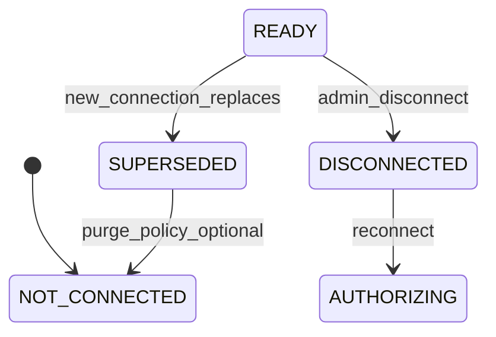

# CCW-0 - Channel Connection Data Scope UI/UX Audit

**Status:** Analysis / product audit only (no UI implementation)
**Agent:** B
**Date:** 2026-06-09
**Master at audit:** `d1389bb` (SRC-1B #195, lead source API #196 merged)

---

## Executive summary

After switching a tenant to a **new Facebook Page**, **new LINE OA**, or **new Instagram account**, operators still see **old test conversations and leads** across Dashboard, Leads, Work Queue, and Analytics. Root cause: all primary surfaces scope data by **`tenant_id`** (and optional **channel type**), not by **active channel connection identity** (`provider_page_id`, LINE bot id, connection record id).

This audit recommends:

1. **Default UI shows only data tied to active READY connections** (per channel type).
2. **ADMIN-only toggle:** "Include disconnected / test connections" (off by default).
3. **Old data:** visible only when toggle on; otherwise **hidden from default lists** but retained in DB (not deleted). When visible, rows carry a **Disconnected connection** marker.
4. **Display connection identity** (Page name / LINE channel name) on inbox rows, chat context, and Leads — never raw Page ID or tokens.
5. **Work Queue and Analytics** need explicit connection-scope rules (Analytics may stay tenant-wide with connection drill-down in a later phase).

Related prior docs: [CCP-0 wizard UX spec](./ccp-0-channel-connect-wizard-ux-spec.md), [CCP-0 platform index](./ccp-0-channel-connect-platform-index.md), [Lead source badge guide](./hubchat-lead-source-badge-operator-guide.md).

---

## Problem statement

| Symptom | Example |
|---------|---------|
| Old Facebook Page threads remain in Inbox | Tenant updated Channel Settings to customer Page B; threads from test Page A still list |
| Leads table mixes channels | Filter is `FACEBOOK` only — cannot distinguish Page A vs Page B |
| Analytics counts include legacy traffic | Tenant-wide aggregates by `channel_type` |
| No operator signal on "which Page" | `provider_page_id` exists on conversation API DTO but is **not shown** in UI |
| Local hide is not connection scope | Dashboard `hiddenLeadMap` is per-browser localStorage, not tenant policy |

**Data model facts (code review):**

- `conversations.provider_page_id` is stored per thread (`src/domain/entities.ts`).
- `GET /api/conversations` returns `provider_page_id` on list items (`src/interfaces/api/inboxDtos.ts`) but Dashboard `ConversationRow` type does not surface it in UI.
- `channel_settings` is **one row per (tenant, channel)** — updating Page ID does not re-tag historical conversations.
- `channel_connections` (CCP-1) supports multi-connection future; resolver flag remains **off** in production.

---

## UI surfaces inspected

### 1. Dashboard Inbox

| Aspect | Current behavior | Gap |
|--------|------------------|-----|
| List query | `GET /api/conversations` + scope/channel/status/SLA filters | No `connectionId` / `providerPageId` filter |
| Channel filter | `LINE` / `FACEBOOK` / `INSTAGRAM` / `all` | Type-only |
| Row display | Lead source badge (`Facebook · DM`) + urgency pills | No connection label (Page name) |
| Hide action | `hiddenLeadMap` in localStorage per tenant | Not shared; not connection-aware; reappears on new device |
| Grouping | `buildLeadListItems` groups by participant identity | Cross-connection grouping possible for same person |

**Files:** `src/ui/DashboardPage.tsx`, `src/ui/dashboardInboxFilters.ts`, `src/ui/chatComposerModel.ts`

### 2. Dashboard chat header / context panel

| Aspect | Current behavior | Gap |
|--------|------------------|-----|
| Header badges | Lead source badge, conversation status, lead status, follow-up | No connection chip |
| Context Details | Customer, Channel (type), Lead source, Assigned, Conversation status | No "Connected as" / Page name |
| Meta line | Thread count when multi-thread lead | No disconnected-connection warning |

**Files:** `src/ui/DashboardPage.tsx` (context panel `dashboard-context-details`)

### 3. Leads page

| Aspect | Current behavior | Gap |
|--------|------------------|-----|
| List query | `GET /api/leads` with `channel` filter (type) | No connection scope |
| Channel column | Lead source badge (uses `sourceType` from API #196) | No Page / LINE channel name |
| Open inbox | Deep-link to conversation id | May open thread from old connection |

**Files:** `src/ui/LeadsPage.tsx`, `src/ui/leadsPageModel.ts`

### 4. Work Queue

| Aspect | Current behavior | Gap |
|--------|------------------|-----|
| List query | `GET /api/workflow/items` | No source/connection fields (by design today) |
| Row display | Channel badge (type) only | Cannot show connection identity |
| Follow-up items | Tied to `conversationId` | Old-connection conversations appear if still OPEN + follow-up |

**Files:** `src/ui/workQueueUi.tsx`, `src/domain/workflow.ts`

### 5. Analytics dashboard

| Aspect | Current behavior | Gap |
|--------|------------------|-----|
| Scope | Tenant-wide read-only aggregates | Includes all historical channel-type traffic |
| Breakdown | `byChannel` (LINE/FACEBOOK/INSTAGRAM) | No per-connection series |
| Audience | ADMIN / MANAGER | No filter for active connections only |

**Files:** `src/ui/AnalyticsPage.tsx`, `app/api/dashboard/metrics/route.ts`

### 6. Channel Settings

| Aspect | Current behavior | Gap |
|--------|------------------|-----|
| Scope | Current `channel_settings` row per channel type | Shows **active** Page ID / account name only |
| History | No list of prior connections | Replacing config does not explain inbox pollution |
| Link to data | No "view conversations for this connection" | Operators lack remediation path |

**Files:** `src/ui/ChannelSettingsPage.tsx`, `src/ui/channelSettingsModel.ts`

### 7. Future Assisted Channel Connection Wizard

| Aspect | Current spec (CCP-0) | Gap for data scope |
|--------|----------------------|-------------------|
| Route | `/dashboard/channel-connect` (planned) | No post-replace data policy |
| State machine | NOT_CONNECTED through READY | No `SUPERSEDED` / `DISCONNECTED` data visibility rules |
| Disconnect | READY to NOT_CONNECTED on confirm | Does not define fate of historical threads |

**Files:** `docs/ccp-0-channel-connect-wizard-ux-spec.md`

---

## Answers to audit questions

### Q1. Should default UI show only active channel connections?

**Yes — recommended default for operator surfaces:**

| Surface | Default scope | Rationale |
|---------|---------------|-----------|
| Dashboard Inbox | Active connections only | Primary operator workflow |
| Chat header / context | N/A (follows selected thread) | Show connection marker on thread |
| Leads | Active connections only | Pipeline hygiene |
| Work Queue | Active connections only | Actionable queue |
| Analytics | **Tenant-wide with banner** (phase 1) | Historical reporting value; add connection filter in CCW-1B+ |
| Channel Settings | Active config only (already) | No change |

**Definition of "active":** `channel_settings.enabled = true` AND test-connection / health status **READY** (or `channel_connections.status = READY` when wizard path is live), matched by:

- Facebook / Instagram: `conversations.provider_page_id` = active `providerPageId`
- LINE: match `channel_thread_id` prefix / bot id metadata when available (Agent A to confirm stable key)

Threads with **null** `provider_page_id` (legacy): treat as **inactive / unknown connection** unless toggle includes legacy.

### Q2. Should admins have an "Include disconnected/test channels" toggle?

**Yes — ADMIN and MANAGER only; default OFF.**

| Property | Recommendation |
|----------|----------------|
| Label | `Include disconnected channels` |
| Helper | `Shows leads and chats from previous Pages or LINE accounts.` |
| Persistence | Per-tenant user preference (localStorage) + optional server flag later |
| SALES | Hidden — always active-connection scope only |
| API | `includeDisconnectedConnections=true` query param on list endpoints (Agent A) |

### Q3. Should old test Page/LINE data be hidden, archived, or visibly marked?

**Recommended: hidden by default + visibly marked when toggle on (not deleted).**

| State | Default lists | Toggle on | DB |
|-------|---------------|-----------|-----|
| Old test Page threads | Hidden | Shown with `Disconnected` chip + muted row style | Retained |
| Resolved old threads | Hidden | Optional sub-filter "Include resolved disconnected" | Retained |
| Purge | Manual admin action (future) | Out of CCW-1A | Separate retention phase |

Do **not** auto-delete on connection replace — operators may need audit trail and SmartKorp support may need migration windows.

### Q4. Should each conversation/lead display connection identity?

**Yes.**

| Surface | Display | Never show |
|---------|---------|------------|
| Inbox row subtitle | `Acme Retail Page` or `LINE: SmartKorp OA` | Numeric Page ID, PSID, tokens |
| Chat context panel | `Connected as: Acme Retail Page` | Raw `provider_page_id` |
| Leads column | Connection label column or sub-label under source badge | Provider account id |
| Work Queue | Connection sub-chip when API adds field | Same |

Resolve label from `channel_settings.providerAccountName` or `channel_connections.provider_account_name` keyed by `provider_page_id` / connection id.

### Q5. How should setup states appear independently for LINE, Facebook, Instagram?

Extend CCP-0 per-channel cards — **independent state** per provider (already in spec). Add **data scope callout** per card:

| Card state | Additional copy |
|------------|-----------------|
| READY | `Showing N conversations for this connection` |
| NOT_CONNECTED (was READY) | `Previous connection data hidden from inbox` |
| RECONNECT_REQUIRED | `New messages may use old threads until reconnected` |
| ERROR | Link to Channel Settings / support runbook |

Wizard must not block Instagram setup because Facebook is READY (orthogonal cards).

### Q6. What empty states are needed when a new channel is connected but has no leads yet?

| Surface | Empty state copy (EN) |
|---------|----------------------|
| Dashboard Inbox (channel filter) | `No conversations yet for {connection name}. Send a test message to this Page to verify inbound.` |
| Leads (channel filter) | `No leads from {connection name} yet.` |
| Work Queue | No change (empty queue is normal) |
| Analytics | `No activity yet for {connection name} in this period.` |
| Wizard post-READY | Inline smoke checklist with "Send test DM" step (CCP-0 already partial) |

Distinguish **empty because filtered** vs **empty because new connection** vs **empty tenant**.

### Q7. Channel type badge vs lead source badge vs channel connection

| Concept | Example | Answers |
|---------|---------|---------|
| **Channel type** | `FACEBOOK` chip (legacy) or implied in connection label | Platform family |
| **Lead source** | `Facebook · Comment` | **How** the customer initiated contact (DM / Comment / Private Reply) |
| **Channel connection** | `Acme Retail Page` | **Which** configured Page / LINE OA / IG account |

**Recommended layout (inbox row):**

```
[Avatar] Customer Name                    2h ago
         Facebook · Comment               <- lead source (SRC-1B)
         Acme Retail Page                 <- connection identity (CCW)
         Preview text...
```

Remove redundant standalone `FACEBOOK` channel badge when connection + source badges present.

### Q8. What should happen when a connection is disconnected/replaced?

| Event | System behavior | UI behavior |
|-------|-----------------|-------------|
| ADMIN saves new Page ID in Channel Settings | Outbound uses new credentials; old `provider_page_id` threads unchanged in DB | Default inbox hides old threads; banner on Channel Settings: `Inbox now shows {new name} only` |
| Wizard disconnect confirmed | Mark connection REVOKED; settings disabled | Same hide policy |
| Operator enables "Include disconnected" | API returns all tenant threads | Disconnected chip on non-matching rows |
| Inbound on old Page (webhook still subscribed) | May still create threads with old page id | Show in disconnected view + ops alert |
| Open old thread from Leads deep link | Allowed when toggle on or direct URL | Banner: `This conversation is from a disconnected channel` |

### Q9. What smoke / E2E tests should cover data-scope UX?

| ID | Scenario | Type |
|----|----------|------|
| CCW-S1 | Tenant with two Page IDs in DB; active settings Page B; default inbox shows only B threads | API contract + E2E |
| CCW-S2 | Toggle on shows Page A threads with disconnected marker | E2E |
| CCW-S3 | SALES user cannot see toggle; never sees disconnected threads | E2E |
| CCW-S4 | Leads list scoped to active connection; toggle expands | E2E |
| CCW-S5 | Context panel shows connection name not Page ID | Unit + E2E |
| CCW-S6 | Replace Page in Channel Settings; inbox count drops for old threads without delete | Integration |
| CCW-S7 | Work Queue excludes disconnected follow-ups by default | API + E2E |
| CCW-S8 | Analytics banner when disconnected data exists but excluded from drill-down | Manual / future E2E |
| CCW-S9 | Empty state when READY connection has zero conversations | E2E |
| CCW-S10 | Lead source badge still correct when connection filter applied | Regression |

Add to `docs/hubchat-smoke-test-inventory.md` when CCW-1B implements UI.

---

## Recommended UX behavior (summary)

1. **Default = active connections only** on Inbox, Leads, Work Queue.
2. **ADMIN/MANAGER toggle** for disconnected/test data (off by default).
3. **Connection identity label** on inbox, context, leads — friendly name only.
4. **Disconnected marker** when legacy data shown.
5. **Independent per-channel setup cards** in wizard with data-scope messaging.
6. **Channel Settings** banner after save explaining inbox scope change.
7. **Analytics** — phase 1 banner; phase 2 connection breakdown (optional).
8. **Do not conflate** lead source badge with connection identity.

---

## Setup Wizard state model (CCW extension)

Inherit CCP-0 display states. Add **data scope annotations**:



| Wizard display | Inbox default | Notes |
|----------------|---------------|-------|
| READY | Show matching threads | Primary |
| SUPERSEDED | Hide (toggle shows) | Prior Page/LINE replaced |
| DISCONNECTED | Hide (toggle shows) | Admin revoked |
| NOT_CONNECTED | N/A | No inbound expected |

Wizard **Step: Verify scope** (new, after outbound smoke): operator confirms inbox shows only new connection test thread.

---

## Connection filter / toggle recommendation

**Inbox filter drawer (ADMIN/MANAGER):**

```
[ ] Include disconnected channels
    Show conversations from previous Facebook Pages,
    LINE accounts, or Instagram connections.
```

**Optional advanced (later):**

- Multi-select connection picker when `channel_connections` supports multiple READY rows per type.

**API contract (Agent A — CCW-1A):**

| Endpoint | New query param | Default |
|----------|-----------------|---------|
| `GET /api/conversations` | `connectionScope=active\|all` | `active` |
| `GET /api/leads` | `connectionScope=active\|all` | `active` |
| `GET /api/workflow/items` | `connectionScope=active\|all` | `active` |

Response additions (optional metadata):

- `connection_label` on list items
- `connection_status: active | disconnected | unknown`

---

## Risks and open questions

| Risk | Severity | Mitigation |
|------|----------|------------|
| LINE lacks stable `provider_page_id` on all threads | High | Agent A: define LINE connection key (bot user id / channel id) |
| Inbound still ENV-coupled for Facebook | High | Document ops constraint until CCP-2 inbound resolver; old Page webhooks may still ingest |
| `provider_page_id` null on legacy rows | Medium | Bucket as `unknown`; toggle "Include legacy unscoped" |
| Analytics rewrite scope confuses managers | Medium | Phase Analytics; keep tenant totals with footnote |
| Multi-device hiddenLeadMap drift | Low | Replace local hide with server scope (CCW-1A) |
| Instagram shares Facebook Page parent | Medium | Clarify connection label shows IG account name; match via `provider_page_id` + channel type |

**Open questions for product:**

1. Should **resolved** disconnected threads ever appear in default inbox?
2. Is **hard purge** of test data a separate admin action (GDPR / customer request)?
3. When two READY Facebook connections exist (future multi-page), is default **all active** or **pick one**?
4. Should Work Queue SLA metrics include disconnected threads in overdue counts?

---

## Proposed next phases

### CCW-1A (Agent A) — API connection scope contract

- `connectionScope` query param on conversations, leads, workflow list
- Resolve active connection ids from `channel_settings` (+ `channel_connections` when flag on)
- Map `provider_page_id` / LINE keys to connection labels
- Unit tests for scope filtering; no UI yet

### CCW-1B (Agent B/C) — UI scope, labels, empty states

- Inbox / Leads / Work Queue default active scope
- ADMIN toggle + disconnected chip
- Connection identity in inbox row + context panel
- Empty states per new connection
- Wizard data-scope step + Channel Settings banner
- E2E tests CCW-S1 through CCW-S10
- Update smoke inventory + operator guide

**Prep branch (draft):** [`docs/ccw-1b-channel-connection-scope-ui-prep.md`](./ccw-1b-channel-connection-scope-ui-prep.md) — model/components/tests; hold merge until CCW-1A.

**Out of CCW-1B:** Analytics connection drill-down (CCW-1C candidate), auto-purge, Marketplace, CDP.

---

## Out of scope (this audit)

- Facebook Profile Image / Display Name enrichment
- `DB_ONLY` or resolver flag enablement
- Marketplace / CDP / Marketing Automation bridge
- Backend implementation (CCW-0 is analysis only)
- Exposing tokens, secrets, PSID, comment id, post id, profile URLs

---

## Verification performed (CCW-0)

| Check | Result |
|-------|--------|
| Code review (UI + API list routes) | Complete |
| Docs-only change | Yes |
| `git diff --check` | Run at commit |
| Hidden/bidi scan | Run at commit |
| `npm run typecheck` | Run at commit |
| `npm run lint` | Run at commit |
| `npm test` | Run at commit |
| `npm run build` | Run at commit |
